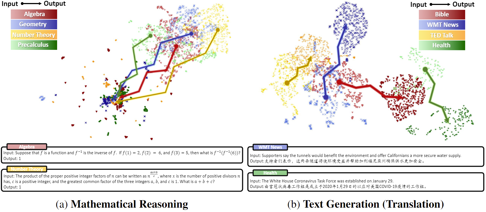
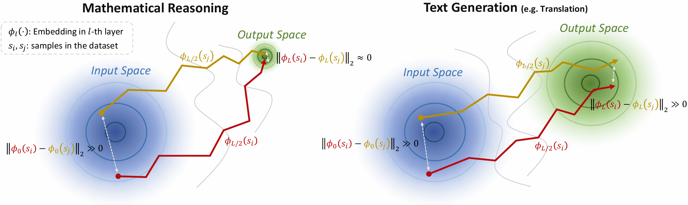
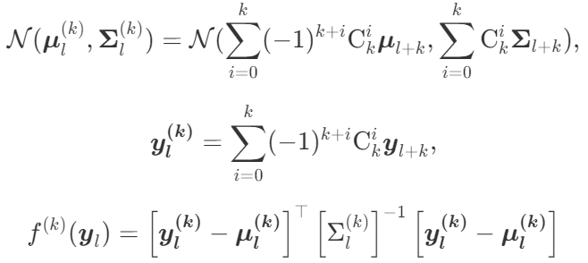
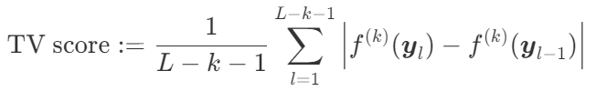

# Trajectory Volatility for Out-of-Distribution Detection in Mathematical Reasoning

The overview and official implementation of **TV score** used in **OOD Detection in Mathematical Reasoning**. 

Details are shown in [our paper](https://arxiv.org/abs/2405.14039).

> Abbreviations: In-Distribution -> ID; Out-of-Distribuion -> OOD

## Overview

### Why Trajectory as the measure?

#### a. Disadvantages of input/output embedding space:

* *Input Space*: Low distinction between different domains

* *Output Space*: compressed high-density search space -> pattern collapse

<!-- {:height="50%" width="50%"} -->

<div align=center>

</div>


#### b. Advantages of input->output embedding shift trajectory:

* Constraints on trajectory endpoints in mathematical reasoning allow for a greater likelihood of variation in trajectory volatility under different samples. 

<!--  -->
<div align=center>

</div>

### What is TV score?

A trajectory-based algorithm to detect OOD samples in mathematical reasoning scenarios.

**Algorithm Pipeline:**

We denote $\boldsymbol{y_l}$ as the embedding of $l$-th layer, $\mathcal{G}_l = \mathcal{N}(\boldsymbol{\mu}_l, \boldsymbol{\Sigma}_l)$ as ID Gaussian distribution of $l$-th layer


* *Step 1*: Mahalanobis Distance Mapping 

<!-- $$ \mathcal{N}(\boldsymbol{\mu}_{l}^{(k)}, \boldsymbol{\Sigma}_{l}^{(k)}) = \mathcal{N}(\sum_{i=0}^{k} (-1)^{k+i} \mathrm{C}_{k}^{i} \boldsymbol{\mu}_{l+k}, \sum_{i=0}^{k} \mathrm{C}_{k}^{i} \boldsymbol{\Sigma}_{l+k}), $$

$$ \boldsymbol{y_{l}^{(k)}} = \sum_{i=0}^{k} (-1)^{k+i} \mathrm{C}_{k}^{i} \boldsymbol{y}_{l+k}, $$

$$ f^{(k)}(\boldsymbol{y}_l) = \left[\boldsymbol{y_l^{(k)}} - \boldsymbol{\mu_l^{(k)}}\right]^{\top} \left[ \Sigma_l^{(k)} \right]^{-1} \left[\boldsymbol{y_l^{(k)}} - \boldsymbol{\mu_l^{(k)}}\right] $$ -->

<!-- $$
\begin{equation}
  \begin{aligned}
    \mathcal{N}(\boldsymbol{\mu}_{l}^{(k)}, \boldsymbol{\Sigma}_{l}^{(k)}) &= \mathcal{N}(\sum_{i=0}^{k} (-1)^{k+i} \mathrm{C}_{k}^{i} \boldsymbol{\mu}_{l+k}, \sum_{i=0}^{k} \mathrm{C}_{k}^{i} \boldsymbol{\Sigma}_{l+k}), \\
    \boldsymbol{y_{l}^{(k)}} &= \sum_{i=0}^{k} (-1)^{k+i} \mathrm{C}_{k}^{i} \boldsymbol{y}_{l+k}, \\
    f^{(k)}(\boldsymbol{y}_l) &= \left[\boldsymbol{y_l^{(k)}} - \boldsymbol{\mu_l^{(k)}}\right]^{\top} \left[ \Sigma_l^{(k)} \right]^{-1} \left[\boldsymbol{y_l^{(k)}} - \boldsymbol{\mu_l^{(k)}}\right] 
  \end{aligned}
\end{equation}
$$ -->

<div align=center>

</div>


* *Step 2*:  Average of Absolute Value Difference

<!-- $$ \text{TV score} := \frac{1}{L-k-1} \sum_{l=1}^{L-k-1}  \left| f^{(k)}(\boldsymbol{y}_l) - f^{(k)}(\boldsymbol{y}_{l-1}) \right| $$ -->

<!-- $$
\begin{equation}
  \text{TV score} := \frac{1}{L-k-1} \sum_{l=1}^{L-k-1}  \left| f^{(k)}(\boldsymbol{y}_l) - f^{(k)}(\boldsymbol{y}_{l-1}) \right|
\end{equation}
$$ -->

<div align=center>

</div>


TV score w/o Differential Smoothing when $k = 0$, w/ Differential Smoothing when $k>0$.


## Usage Instruction (Batch Computation)

### Step 1: ID Fine-tuning

First, fine-tuning the base model with ID dataset (MultiArith).

```shell
cd your/project/root/folder/path/
bash Scripts/finetune.sh
```

Details of ```Scripts/finetune.sh``` are as below:

```shell
#!/bin/bash

export PROJECT_PATH="your/project/root/folder/path/"
export MODEL_PATH="your/model/repository/root/folder/path/"
export CUDA_VISIBLE_DEVICES="0,1,2,3,4,5,6,7"   # gpu id

model_name="llama2-7b"  # SFT model name

python FineTune/ID_finetune.py --model_name $model_name
```

After fine-tuning, checkpoints will be stored in ```os.environ['PROJECT_PATH']/Checkpoints/$model_name```


### Step 2: ID/OOD Inference

Next, conduct inference for all ID/OOD datasets using the checkpoint just fine-tuned.

```shell
cd your/project/root/folder/path/
bash Scripts/inference.sh
```

Details of ```Scripts/inference.sh``` are as below:

```shell
#!/bin/bash

export PROJECT_PATH="your/project/root/folder/path/"
export MODEL_PATH="your/model/repository/root/folder/path/"
export CUDA_VISIBLE_DEVICES="0,1"  # gpu id

model_name="llama2-7b"  # SFT model name
max_output_token_num="16"
ckpt_step="10000"   # checkpoint step as you selected

dataset_list=(MultiArith GSM8K SVAMP AddSub SingleEq SingleOp)
category="X"
for i in ${dataset_list[*]}; do
    python Inference/ID_OOD_inference.py --model_name $model_name \
                                         --dataset "$i" \
                                         --category $category \
                                         --max_output_token_num $max_output_token_num \
                                         --ckpt_step $ckpt_step
done

dataset="MATH"
category_list=(algebra geometry counting_and_probability number_theory precalculus)
for i in ${category_list[*]}; do
    python Inference/ID_OOD_inference.py --model_name $model_name \
                                         --dataset $dataset \
                                         --category "$i" \
                                         --max_output_token_num $max_output_token_num \
                                         --ckpt_step $ckpt_step
done
```

After inference, all inference results will be stored in ```os.environ['PROJECT_PATH']/Data/Inference_Data/$model_name```. Each sample corresponds to one dictionary.

```shell
{  
  "id": i,
  "hidden_state": hidden_states,
  "output_scores": output_scores,
  "output_seq": output_seq
}
```

### Step 3: ID/OOD TV Score Computation

Finally, computer TV scores for each dataset in all ID/OOD datasets.

```shell
cd your/project/root/folder/path/
bash Scripts/computation.sh
```

Details of ```Scripts/computation.sh``` are as below:


```shell
#!/bin/bash

export PROJECT_PATH="your/project/root/folder/path/"

model_name="llama2-7b"
max_output_token_num="16"
max_order="5"   # Differential Smoothing Order

dataset_list=(MultiArith GSM8K SVAMP AddSub SingleEq SingleOp)
category="X"
for i in ${dataset_list[*]}; do
    python Computation/ID_OOD_score.py --model_name $model_name \
                                       --dataset "$i" \
                                       --category $category \
                                       --max_output_token_num $max_output_token_num \
                                       --max_order $max_order
done

dataset="MATH"
category_list=(algebra geometry counting_and_probability number_theory precalculus)
for i in ${category_list[*]}; do
    python Computation/ID_OOD_score.py --model_name $model_name \
                                       --dataset $dataset \
                                       --category "$i" \
                                       --max_output_token_num $max_output_token_num \
                                       --max_order $max_order
done
```

After computation, all scores will be stored in ```os.environ['PROJECT_PATH']/Data/Score_Data/$model_name```.


## Citation
If methods and conclusions in our paper are inspiring, you can support our work by citation. Thanks!

```
@article{wang2024trajectory,
  title={Trajectory Volatility for Out-of-Distribution Detection in Mathematical Reasoning},
  author={Wang, Yiming and Zhang, Pei and Yang, Baosong and Wong, Derek F and Zhang, Zhuosheng and Wang, Rui},
  journal={arXiv preprint arXiv:2405.14039},
  year={2024}
}
```